  <picture>
    <source media="(prefers-color-scheme: dark)" srcset="assets/dark.svg" />
    <source media="(prefers-color-scheme: light)" srcset="assets/light.svg" />
    
  </picture>

<h3 align="center">Technical Product Manager · Mechatronics Engineer</h3>

Automation · Robotics · Industrial AI · Manufacturing Technology

Mechatronics Engineer turned Technical Product Manager, working at the intersection of robotics, industrial automation, and AI. I design and ship systems that combine embedded hardware, control software, and machine learning, from PLC-driven manufacturing cells to AI-powered vision pipelines, taking ideas from concept through to deployed, production-ready systems.

---

### 💻 Tech Stack

**Development**

**Product & Project Management**

Agile • Scrum • Kanban

**Artificial Intelligence**

**Automation & Robotics**

**Industrial Automation**

OpenPLC • Ladder Logic • FluidSIM

**Data Science**

**CAD / Design**

**Simulation & Digital Twins**

Industrial Simulation • Digital Twins

**Workflow Automation**

### 📂 Featured Projects

> [!TIP]
> Click a category to expand it. Every project here combines software, hardware, and industrial engineering, built and tested in real robotics and automation contexts.

<b>🤖 Robotics & Manufacturing</b>

#### O.R.F.E.O.
Collaborative robotic assembly system simulation. Combines industrial automation, AI/computer vision, and embedded systems.

  

#### Autonomous Drone Manufacturing Cell
Flexible manufacturing cell for drone assembly, inspection, packaging, and transport using multiple collaborative robotic arms. Modular 6-DOF architecture, CODESYS (IEC 61131-3) control, full Unity simulation, computer vision, trajectory planning, and multi-robot coordination for Industry 4.0.

    

#### Digital Twin Manufacturing System
Digital twin of a production line that syncs the virtual environment with physical robots for testing, monitoring, and validation before deployment. Real-time communication, 3D visualization, collision detection, and process optimization.

   

#### Multi-Robot Collaborative Platform
Distributed system where multiple robots coordinate to transport, assemble, and manipulate objects. Distributed communication and task planning, scalable to multiple agents.

   

#### Mobile Robot Navigation Platform
Omnidirectional mobile robot with Mecanum wheels, IMU, QTR line sensors, and ultrasonic sensing, built for autonomous navigation and line following.

  

#### Robotics Control Framework
Modular, extensible framework for controlling multiple actuators and sensors, including synchronized control across several PCA9685 servo drivers.

  

#### Robotics Simulation Toolkit
Collection of tools for simulating industrial robots, kinematics, and trajectories, for virtual testing and 3D visualization before physical implementation.

 

<b>👁️ AI & Automation</b>

#### AI Vision System
Real-time computer vision for object detection, tracking, and analysis via cameras and AI models. Integrated with robots, tuned for low latency.

   

#### AI Workflow Automation
Process automation using AI agents that integrate multiple tools and services through APIs.

  

<b>📡 Embedded & IoT</b>

#### ESP32 Remote Camera Network
ESP32-CAM infrastructure for remote monitoring and low-latency video streaming (MJPEG over WebSockets), with remote control and AI integration.

   

#### Industrial IoT Monitoring Platform
Real-time acquisition, dashboarding, and remote monitoring of industrial sensor data, integrated with PLCs.

  

<b>🛠️ Engineering & Tools</b>

#### Engineering Design Repository
Mechanical and electronic designs for automation and robotics projects: PCB design, CAD, 3D modeling, mechanical drawings, and electrical diagrams.

   

#### Industrial Software Projects
Collection of industrial applications for automation, monitoring, and control, including HMI interfaces and hardware integration.

  

---

### 📊 GitHub Stats

  

  
  

  <picture>
    <source media="(prefers-color-scheme: dark)" srcset="https://raw.githubusercontent.com/jorgefajardom-coder/jorgefajardom-coder/output/github-contribution-grid-snake-dark.svg" />
    <source media="(prefers-color-scheme: light)" srcset="https://raw.githubusercontent.com/jorgefajardom-coder/jorgefajardom-coder/output/github-contribution-grid-snake.svg" />
    
  </picture>

### 🤝 Let's Connect

  
  &nbsp;&nbsp;
  
  &nbsp;&nbsp;
  

